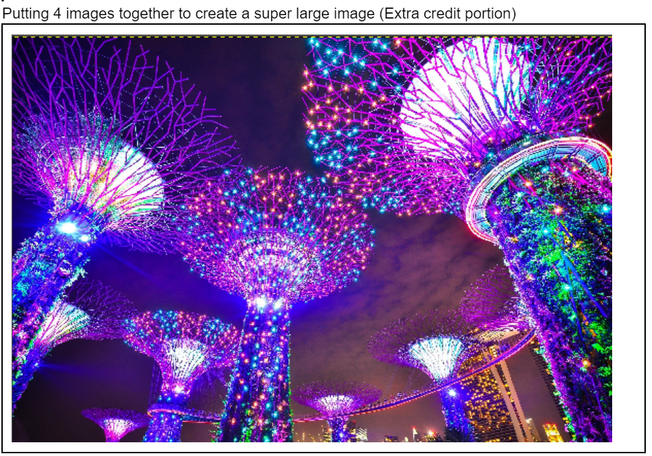

# TGAImageFile
A C++ program that interacts with TGA file formats, showcasing different types of basic photoshop blending function with 2 images.

# Examples of the blending functions and image manipulations performed

