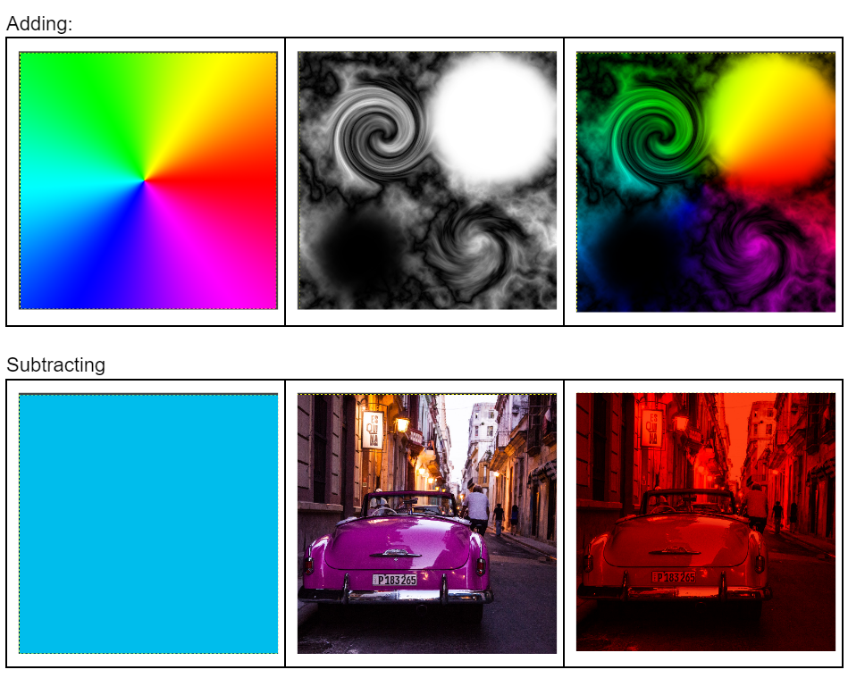
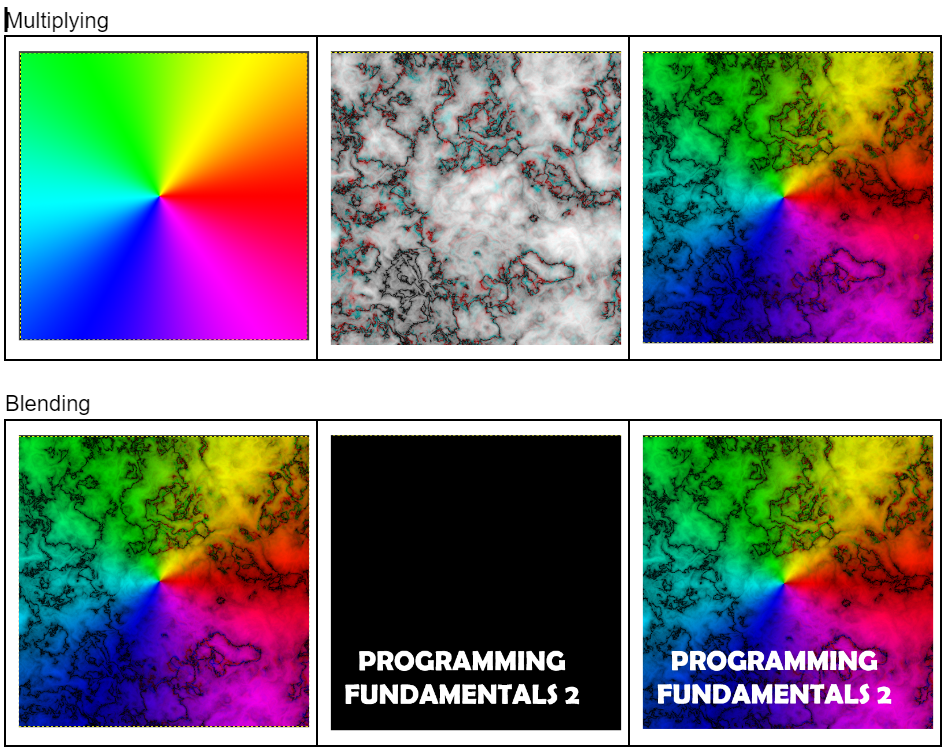
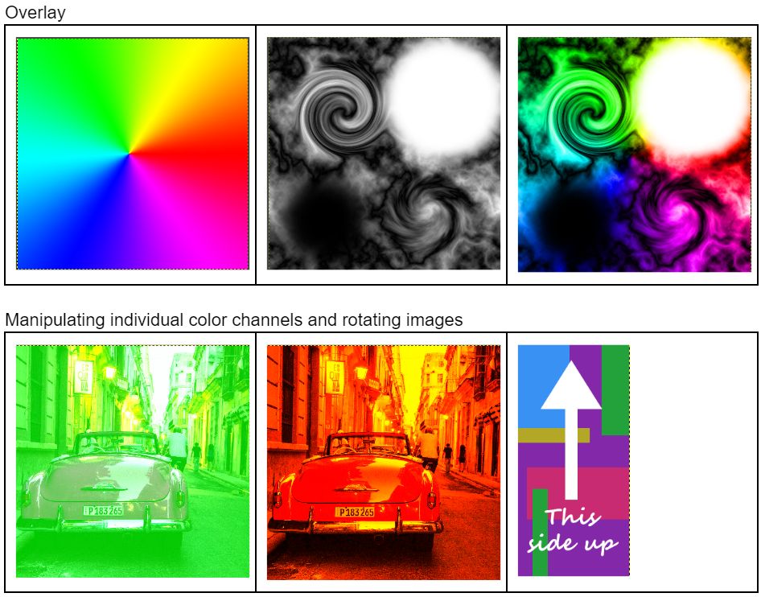
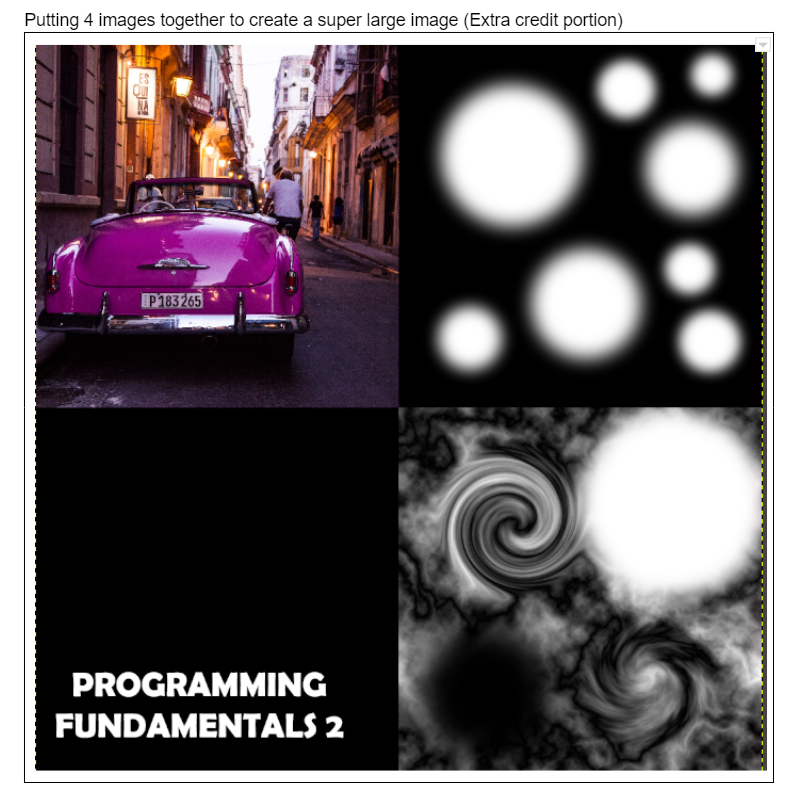

# TGAImageFile
A C++ program that interacts with TGA file formats, showcasing different types of basic photoshop blending function with 2 images.

# Topics:
- Reading of binary files into class instances
- Pointers
- Photoshop blending function 

# Examples of the blending functions and image manipulations performed (inputs are the first two images, adding through overlaying)

